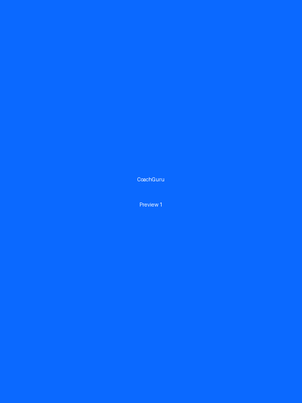
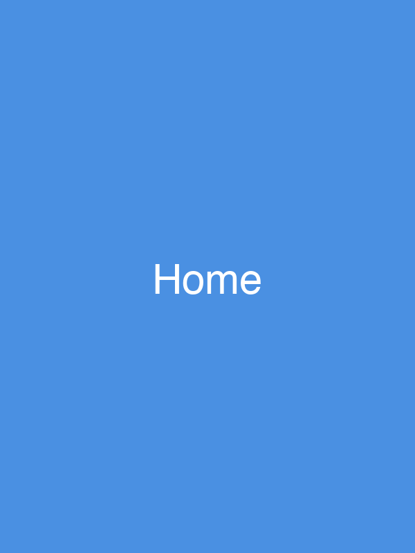
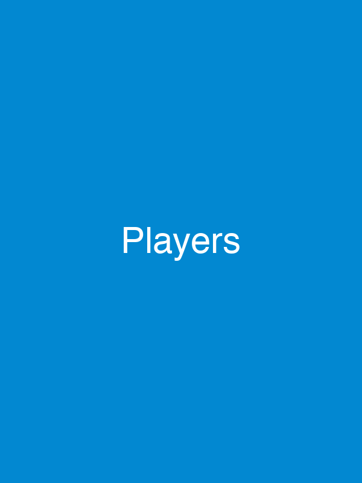
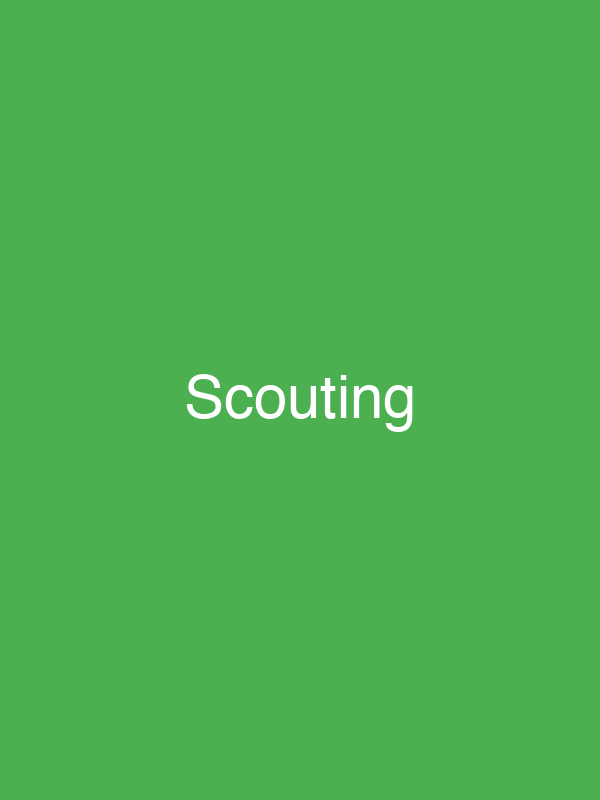
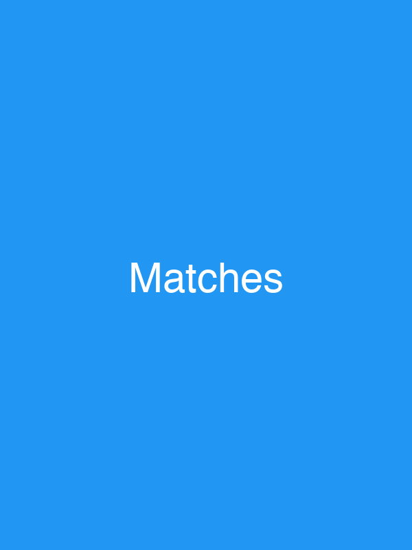
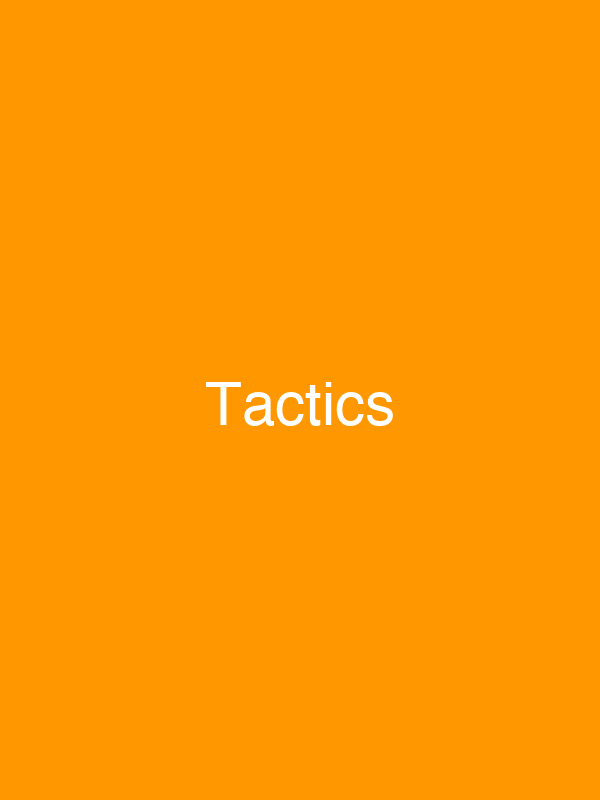

# <span style="background: linear-gradient(135deg, #0b69ff 0%, #00c2ff 100%); -webkit-background-clip: text; -webkit-text-fill-color: transparent; background-clip: text;">⚽ CoachGuru</span> – Football Coaching App

<div align="center">


### <span style="background: linear-gradient(135deg, #0b69ff 0%, #00c2ff 100%); -webkit-background-clip: text; -webkit-text-fill-color: transparent; background-clip: text;">Next-gen football coaching in your pocket</span>

<div align="center">

[](https://flutter.dev)
[](https://github.com/GuruGroup-de/coachguru-app)
[](https://flutter.dev)
[](LICENSE)
[](https://github.com/GuruGroup-de/coachguru-app/stargazers)
[](https://github.com/GuruGroup-de/coachguru-app/network/members)
[](https://github.com/GuruGroup-de/coachguru-app/commits/main)

</div>

<div align="center" style="margin: 20px 0;">

<a href="docs/apk/coachguru-latest.apk" download style="display: inline-block; padding: 12px 30px; background: linear-gradient(135deg, #0b69ff 0%, #00c2ff 100%); color: white; text-decoration: none; border-radius: 25px; font-weight: 600; font-size: 16px; box-shadow: 0 4px 15px rgba(11, 105, 255, 0.3); transition: transform 0.2s, box-shadow 0.2s; margin: 5px;" onmouseover="this.style.transform='translateY(-2px)'; this.style.boxShadow='0 6px 20px rgba(11, 105, 255, 0.4)';" onmouseout="this.style.transform='translateY(0)'; this.style.boxShadow='0 4px 15px rgba(11, 105, 255, 0.3)';">📱 Download APK</a>

<a href="https://gurugroup-de.github.io/coachguru-app" target="_blank" rel="noopener noreferrer" style="display: inline-block; padding: 12px 30px; background: linear-gradient(135deg, #4A90E2 0%, #0288D1 100%); color: white; text-decoration: none; border-radius: 25px; font-weight: 600; font-size: 16px; box-shadow: 0 4px 15px rgba(74, 144, 226, 0.3); transition: transform 0.2s, box-shadow 0.2s; margin: 5px;" onmouseover="this.style.transform='translateY(-2px)'; this.style.boxShadow='0 6px 20px rgba(74, 144, 226, 0.4)';" onmouseout="this.style.transform='translateY(0)'; this.style.boxShadow='0 4px 15px rgba(74, 144, 226, 0.3)';">🌐 Visit Website</a>

<a href="https://www.instagram.com/coachguru1" target="_blank" rel="noopener noreferrer" style="display: inline-block; padding: 12px 30px; background: linear-gradient(135deg, #E4405F 0%, #F77737 50%, #FCAF45 100%); color: white; text-decoration: none; border-radius: 25px; font-weight: 600; font-size: 16px; box-shadow: 0 4px 15px rgba(228, 64, 95, 0.3); transition: transform 0.2s, box-shadow 0.2s; margin: 5px;" onmouseover="this.style.transform='translateY(-2px)'; this.style.boxShadow='0 6px 20px rgba(228, 64, 95, 0.4)';" onmouseout="this.style.transform='translateY(0)'; this.style.boxShadow='0 4px 15px rgba(228, 64, 95, 0.3)';">📷 Instagram</a>

</div>

[📖 Documentation](docs/index.html) • [🐛 Report Bug](https://github.com/GuruGroup-de/coachguru-app/issues) • [💡 Request Feature](https://github.com/GuruGroup-de/coachguru-app/issues)

</div>

---

## <span style="background: linear-gradient(135deg, #0b69ff 0%, #00c2ff 100%); -webkit-background-clip: text; -webkit-text-fill-color: transparent; background-clip: text;">📱 Live App Preview</span>

<div align="center" style="margin: 40px 0;">



<p style="margin-top: 15px; color: #666; font-size: 0.95rem;">Watch CoachGuru in action</p>

</div>

---

## 🎨 Color Palette

<div align="center">

### CoachGuru Brand Colors

<table>
<tr>
<td align="center">
<div style="width: 120px; height: 120px; background: #0b69ff; border-radius: 15px; box-shadow: 0 4px 15px rgba(11, 105, 255, 0.3); margin: 10px;"></div>
<br><strong>#0b69ff</strong><br>Primary Blue
</td>
<td align="center">
<div style="width: 120px; height: 120px; background: #00c2ff; border-radius: 15px; box-shadow: 0 4px 15px rgba(0, 194, 255, 0.3); margin: 10px;"></div>
<br><strong>#00c2ff</strong><br>Secondary Blue
</td>
<td align="center">
<div style="width: 120px; height: 120px; background: #050816; border-radius: 15px; box-shadow: 0 4px 15px rgba(5, 8, 22, 0.3); margin: 10px;"></div>
<br><strong>#050816</strong><br>Dark
</td>
<td align="center">
<div style="width: 120px; height: 120px; background: #1a2a6c; border-radius: 15px; box-shadow: 0 4px 15px rgba(26, 42, 108, 0.3); margin: 10px;"></div>
<br><strong>#1a2a6c</strong><br>Dark Blue
</td>
</tr>
</table>

### Gradient Examples

<div style="width: 100%; height: 60px; background: linear-gradient(135deg, #0b69ff 0%, #00c2ff 100%); border-radius: 10px; margin: 10px 0; box-shadow: 0 4px 15px rgba(11, 105, 255, 0.3);"></div>
<p style="margin: 5px 0;"><strong>Primary Gradient:</strong> #0b69ff → #00c2ff</p>

<div style="width: 100%; height: 60px; background: linear-gradient(135deg, #050816 0%, #1a2a6c 100%); border-radius: 10px; margin: 10px 0; box-shadow: 0 4px 15px rgba(5, 8, 22, 0.3);"></div>
<p style="margin: 5px 0;"><strong>Dark Gradient:</strong> #050816 → #1a2a6c</p>

<div style="width: 100%; height: 60px; background: linear-gradient(135deg, #1a2a6c 0%, #0b69ff 50%, #00c2ff 100%); border-radius: 10px; margin: 10px 0; box-shadow: 0 4px 15px rgba(11, 105, 255, 0.3);"></div>
<p style="margin: 5px 0;"><strong>Blue Gradient:</strong> #1a2a6c → #0b69ff → #00c2ff</p>

For detailed usage guidelines, see [Theme Documentation](docs/theme/theme.md)

</div>

---

## <span style="background: linear-gradient(135deg, #0b69ff 0%, #00c2ff 100%); -webkit-background-clip: text; -webkit-text-fill-color: transparent; background-clip: text;">📋 Overview</span>

**CoachGuru** is a comprehensive mobile application designed for professional football coaches to manage their teams, track player performance, analyze tactics, and record match statistics. Built with Flutter for cross-platform compatibility, CoachGuru helps you stay organized and make data-driven coaching decisions.

Whether you're managing a youth team or a professional squad, CoachGuru provides all the tools you need to elevate your coaching game. From player profiles to tactical boards, from match statistics to video analysis – everything you need is in one powerful app.

---

## <span style="background: linear-gradient(135deg, #0b69ff 0%, #00c2ff 100%); -webkit-background-clip: text; -webkit-text-fill-color: transparent; background-clip: text;">✨ Features</span>

### 👥 Player Management
- **Player Profiles**: Track detailed player information including name, position, birth year, strong foot, and photo
- **Statistics Tracking**: Monitor goals, assists, match history, and performance metrics
- **Attendance Tracking**: Record training attendance with session types (Training, Match, Fitness)
- **Performance Analytics**: View attendance percentages and performance trends

### ⚽ Match History
- **Match Records**: Maintain a complete history of all matches with results, dates, and types
- **Match Statistics**: Track shots, passes, possession, goals, assists, and more
- **Timeline Events**: Record key moments like goals, assists, substitutions, and cards
- **Detailed Match Reports**: View comprehensive match details and statistics

### 📝 Training Management
- **Training Squad**: Manage training sessions with date and session type selection
- **Attendance Tracking**: Mark player attendance (Yes/No) for each session
- **Statistics Dashboard**: View attendance percentages with visual charts
- **Session Types**: Organize by Training, Match, or Fitness sessions

### 🔍 Scouting Reports
- **Player Scouting**: Create detailed scouting reports with strengths, weaknesses, and potential
- **Scouting Templates**: Use predefined templates for quick report generation
- **Player-Specific Notes**: Link scouting notes to individual players
- **Report Management**: View, edit, and organize all scouting reports

### 🎯 Tactic Board
- **Interactive Tactics**: Design formations and visualize team tactics on an interactive board
- **Formation Presets**: Quick access to common formations (4-4-2, 4-3-3, 3-5-2, 2-3-1)
- **Team Management**: Switch between teams and save custom formations
- **Drag & Drop**: Intuitive player positioning with free movement

### 📹 Video Analysis *(Coming Soon)*
- **Video Import**: Import videos from device gallery
- **Moment Marking**: Mark key moments with timestamps and annotations
- **Thumbnail Generation**: Auto-generate thumbnails for video moments
- **Playback Controls**: Full video player with timeline navigation

---

## <span style="background: linear-gradient(135deg, #0b69ff 0%, #00c2ff 100%); -webkit-background-clip: text; -webkit-text-fill-color: transparent; background-clip: text;">📸 Screenshots</span>

<div align="center">

<table>
<tr>
<td align="center" width="33%">

<br><strong>Home Screen</strong>
</td>
<td align="center" width="33%">

<br><strong>Player Management</strong>
</td>
<td align="center" width="33%">

<br><strong>Scouting Reports</strong>
</td>
</tr>
<tr>
<td align="center" width="33%">

<br><strong>Match History</strong>
</td>
<td align="center" width="33%">

<br><strong>History</strong>
</td>
<td align="center" width="33%">

<br><strong>Tactics Board</strong>
</td>
</tr>
</table>

</div>

---

## <span style="background: linear-gradient(135deg, #0b69ff 0%, #00c2ff 100%); -webkit-background-clip: text; -webkit-text-fill-color: transparent; background-clip: text;">🚀 Installation</span>

### Prerequisites

- [Flutter SDK](https://flutter.dev/docs/get-started/install) (3.24 or higher)
- [Dart SDK](https://dart.dev/get-dart) (3.0 or higher)
- Android Studio / Xcode (for platform-specific builds)
- Git

### Clone the Repository

```bash
git clone https://github.com/GuruGroup-de/coachguru-app.git
cd coachguru-app
```

### Install Dependencies

```bash
flutter pub get
```

### Run the App

```bash
# Run on connected device/emulator
flutter run

# Run on specific platform
flutter run -d android
flutter run -d ios
flutter run -d web
```

### Build APK (Android)

```bash
# Debug APK
flutter build apk --debug

# Release APK
flutter build apk --release

# The APK will be located at:
# build/app/outputs/flutter-apk/app-release.apk
```

### Build IPA (iOS)

```bash
# Release IPA (requires Xcode and Apple Developer account)
flutter build ipa --release
```

---

## <span style="background: linear-gradient(135deg, #0b69ff 0%, #00c2ff 100%); -webkit-background-clip: text; -webkit-text-fill-color: transparent; background-clip: text;">📥 Download</span>

### Direct APK Download

[](docs/apk/coachguru-latest.apk)

Click the button above or visit the [releases page](https://github.com/GuruGroup-de/coachguru-app/releases) for the latest version.

---

## <span style="background: linear-gradient(135deg, #0b69ff 0%, #00c2ff 100%); -webkit-background-clip: text; -webkit-text-fill-color: transparent; background-clip: text;">🛠 Tech Stack</span>

- **Framework**: [Flutter](https://flutter.dev) 3.24+
- **Language**: [Dart](https://dart.dev) 3.0+
- **State Management**: Provider
- **Local Storage**: SharedPreferences
- **Image Picker**: image_picker
- **Video Player**: video_player, chewie
- **Charts**: fl_chart
- **Screenshots**: screenshot
- **Sharing**: share_plus

### Key Dependencies

```yaml
provider: ^6.1.1
shared_preferences: ^2.2.2
image_picker: ^1.0.7
path_provider: ^2.1.2
uuid: ^4.3.3
fl_chart: ^0.68.0
video_player: ^2.10.1
chewie: ^1.7.4
video_thumbnail: ^0.5.6
screenshot: ^3.0.0
share_plus: ^7.2.0
```

---

## <span style="background: linear-gradient(135deg, #0b69ff 0%, #00c2ff 100%); -webkit-background-clip: text; -webkit-text-fill-color: transparent; background-clip: text;">📁 Project Structure</span>

```
coachguru-app/
├── lib/
│   ├── main.dart                 # App entry point
│   ├── theme/
│   │   └── theme.dart            # App theme configuration
│   ├── player/
│   │   ├── player_model.dart
│   │   ├── player_provider.dart
│   │   ├── player_profile_screen.dart
│   │   ├── add_player_screen.dart
│   │   └── edit_player_screen.dart
│   ├── history/
│   │   ├── models/
│   │   ├── providers/
│   │   ├── screens/
│   │   └── widgets/
│   ├── scouting/
│   │   ├── screens/
│   │   └── scouting_template_screen.dart
│   ├── tactic/
│   │   ├── models/
│   │   ├── providers/
│   │   ├── screens/
│   │   └── widgets/
│   ├── training/
│   │   ├── providers/
│   │   ├── screens/
│   │   └── widgets/
│   ├── stats/
│   │   ├── models/
│   │   ├── providers/
│   │   ├── screens/
│   │   └── widgets/
│   ├── video/
│   │   ├── models/
│   │   ├── providers/
│   │   ├── screens/
│   │   └── utils/
│   ├── models/
│   ├── providers/
│   ├── utils/
│   └── widgets/
├── android/                      # Android platform files
├── ios/                          # iOS platform files
├── docs/                         # Documentation and website
│   ├── index.html               # Landing page
│   ├── images/                  # Screenshots
│   └── apk/                     # APK downloads
├── assets/                       # App assets (images, icons)
├── test/                         # Unit and widget tests
└── pubspec.yaml                  # Dependencies and metadata
```

---

## <span style="background: linear-gradient(135deg, #0b69ff 0%, #00c2ff 100%); -webkit-background-clip: text; -webkit-text-fill-color: transparent; background-clip: text;">🗺 Roadmap</span>

### ✅ Completed Features
- [x] Player Management System
- [x] Match History & Statistics
- [x] Training Attendance Tracking
- [x] Scouting Reports
- [x] Tactic Board with Formations
- [x] Modern UI Theme System
- [x] Local Data Persistence

### 🚧 In Progress
- [ ] Video Analysis Module (UI complete, functionality in progress)
- [ ] Firebase Integration
- [ ] Cloud Sync
- [ ] Export/Import Data

### 📋 Planned Features
- [ ] **Advanced Analytics**: Detailed performance charts and insights
- [ ] **Team Collaboration**: Share data with assistant coaches
- [ ] **Match Live Tracking**: Real-time match statistics during games
- [ ] **Custom Formations**: Save and share custom tactical formations
- [ ] **Player Comparison**: Compare multiple players side-by-side
- [ ] **Season Overview**: Annual statistics and trends
- [ ] **Multi-language Support**: Support for multiple languages
- [ ] **Dark Mode**: Complete dark theme support
- [ ] **Widgets**: Home screen widgets for quick access
- [ ] **Notifications**: Reminders for matches and training sessions

---

## <span style="background: linear-gradient(135deg, #0b69ff 0%, #00c2ff 100%); -webkit-background-clip: text; -webkit-text-fill-color: transparent; background-clip: text;">🤝 Contributing</span>

Contributions are welcome! We love your input and want to make contributing as easy as possible.

Please read our [Contributing Guidelines](CONTRIBUTING.md) for details on:
- How to clone and run the project
- Branch naming conventions
- Commit message style (Conventional Commits)
- How to report issues
- How to submit pull requests

We also have a [Code of Conduct](CODE_OF_CONDUCT.md) that we expect all contributors to follow.

### Quick Start

1. Fork the repository
2. Create your feature branch (`git checkout -b feature/AmazingFeature`)
3. Commit your changes (`git commit -m 'feat(scope): Add some AmazingFeature'`)
4. Push to the branch (`git push origin feature/AmazingFeature`)
5. Open a Pull Request

---

## <span style="background: linear-gradient(135deg, #0b69ff 0%, #00c2ff 100%); -webkit-background-clip: text; -webkit-text-fill-color: transparent; background-clip: text;">📞 Support & Contact</span>

- **Instagram**: [@coachguru1](https://www.instagram.com/coachguru1)
- **GitHub Issues**: [Report a bug or request a feature](https://github.com/GuruGroup-de/coachguru-app/issues)
- **Website**: [View landing page](https://GuruGroup-de.github.io/coachguru-app/)

---

## <span style="background: linear-gradient(135deg, #0b69ff 0%, #00c2ff 100%); -webkit-background-clip: text; -webkit-text-fill-color: transparent; background-clip: text;">📄 License</span>

This project is licensed under the MIT License - see the [LICENSE](LICENSE) file for details.

---

## 🙏 Acknowledgments

- Built with [Flutter](https://flutter.dev)
- Icons and UI inspiration from Material Design
- Special thanks to all contributors and testers

---

<div align="center">

**Made with ⚽ by CoachGuru Team**

[⬆ Back to Top](#-coachguru--football-coaching-app)

</div>
